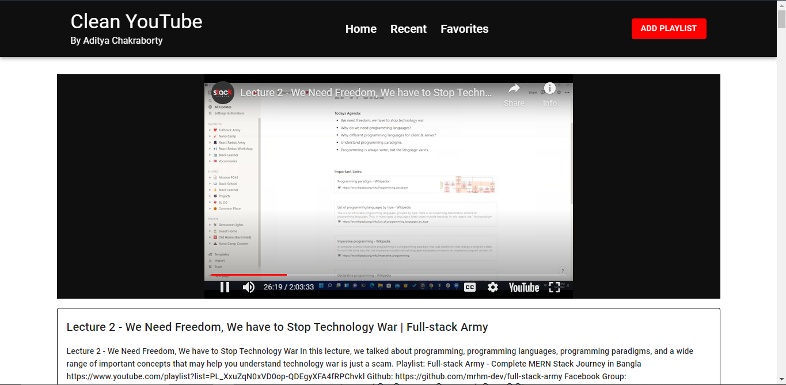

# Clean Youtube Project


## Overview

When we watch a playlist in youtube, we often distracted by other recommended videos. This application helps us to not distract by any other videos. We just paste the valid playlist id or link. And we watch the playlist without any distraction. This app will not show any recommended videos or any ad. We watch the playlist as if we watched in a course site video player.

## Features

- Add a playlist by paste playlist id
- Delete playlist
- Automatically add recent playlists to the recent page
- You can add your favorites playlist in favorites page
- When you click a playlist card it will show the details of playlist
- On the playlist page you can click any video of that playlist.
- All playlists will save in the browser localStorage.
- You can watch the video without any distraction.

## Used Tools

- [Vite](https://vitejs.dev/): For scaffolding the react project
- [Axios](https://axios-http.com/docs/intro): For HTTP request handling
- [MUI](https://mui.com/): For UI and Icons
- [Easy-peasy](https://easy-peasy.vercel.app/): For state management
- [React Router](https://reactrouter.com/en/main): For routing the page
- [React-youtube](https://github.com/tjallingt/react-youtube): For playing the video

## Screenshots

### Home Page


### Form


### Playlist Details Page


### Video Player Page




## How to use this repository

### Clone the repository

```sh
git clone https://github.com/adityackr/clean-youtube.git
```

### Install all dependencies

```sh
yarn
```

### Run the server

```sh
yarn dev
```

> Don't forget to add your google developer api key in your .env file
